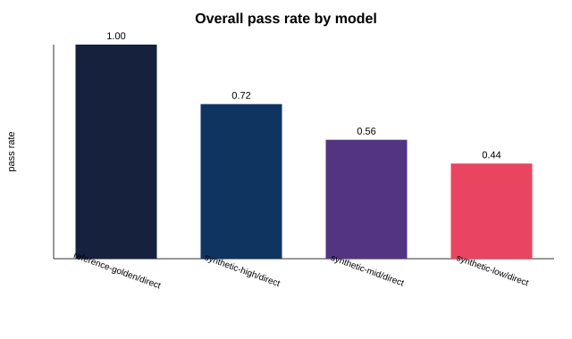
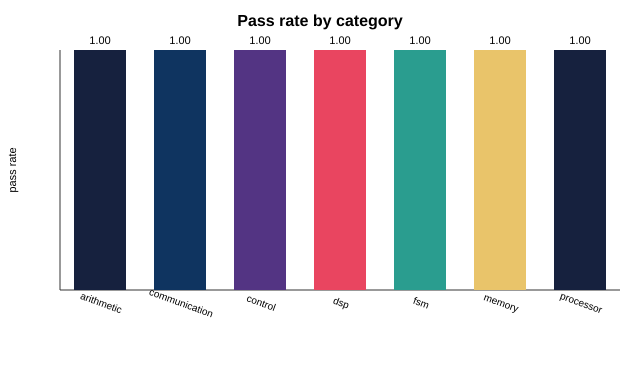
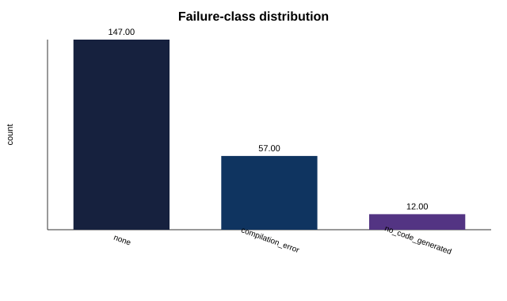

# An Extensible, Reproducible Platform for Evaluating LLM-Assisted Hardware Design

**hdleval** — Technical Report (auto-generated from experiment `baseline-v1`)

## Abstract

We present hdleval, a research platform for the reproducible evaluation of
language-model-assisted hardware design. The platform separates model inference
from a fixed evaluation harness, defines a versioned, taxonomy-driven benchmark
suite spanning arithmetic, finite-state-machine, communication-protocol,
memory, processor, DSP and control designs, and computes quantitative metrics
well beyond pass/fail — including compilation, synthesis and simulation success,
static structural complexity, hardware-resource utilisation and failure
classification. Every table and figure in this report is regenerated from a
single experiment registry. In the reported baseline of 216
evaluations across 18 benchmarks, the strongest configuration
(reference-golden) reaches a pass rate of 1.0.

## 1. Introduction

Large language models increasingly generate hardware description language (HDL),
yet evaluation practice remains anecdotal: single designs, hand-inspected
outputs, and no shared, versioned benchmark. hdleval addresses this with an
experimental framework built for scientific rigour, reproducibility and
extensibility rather than as an application.

## 2. Background and Related Work

Prior HDL-generation efforts typically demonstrate a handful of designs without
a controlled harness, resource metrics, or statistical treatment. Benchmarks in
adjacent areas (software code generation) show the value of large, versioned
suites with automatic grading; hdleval brings that discipline to hardware, where
grading additionally requires compilation, synthesis and simulation.

## 3. Research Questions and Hypotheses

**RQ1.** Can a single evaluation harness fairly compare heterogeneous HDL
generators across a broad design taxonomy? **RQ2.** Which quantitative signals
(beyond functional pass/fail) discriminate between generators? **RQ3.** How does
generation quality degrade with objective benchmark difficulty?

We hypothesise (H1) that a config-driven harness yields stable, reproducible
rankings; (H2) that resource- and structure-level metrics reveal differences
masked by pass/fail; and (H3) that pass rate declines monotonically with the
objective difficulty score.

## 4. System Architecture

The platform is layered: configuration, model providers, prompt strategies, HDL
parsing, the benchmark suite, toolchain adapters (GHDL/Yosys), metrics, the
evaluation harness, the experiment registry, the leaderboard and the reporting
subsystem. Inference is injected as a `ModelProvider`; adding a model never
touches evaluation logic (RQ1).

## 5. Benchmark Design

Each benchmark is structured metadata: a natural-language specification,
functional requirements, expected interface, an optional verified reference
implementation, verification assets, a category, tags and complexity metrics.
An objective difficulty score is a fixed weighted sum over state complexity,
arithmetic complexity, concurrency, hierarchy depth, timing constraints,
interface count and control complexity. The suite is versioned independently.

## 6. Evaluation Harness

Every benchmark passes through one identical procedure: load spec → build prompt
→ infer → parse → compile → synthesize → simulate → compute metrics → check
properties → classify failure → record. Toolchain stages degrade to `skipped`
when a tool is absent, so the harness runs anywhere while remaining strict under
`HDLEVAL_REQUIRE_TOOLS=1` in CI.

## 7. Experimental Setup

The baseline compares a deterministic reference (upper bound) provider against
three synthetic-fidelity baselines that model imperfect generators. This isolates
the measurement machinery from any particular model API and is fully
reproducible; a real model is evaluated by switching to the `anthropic`
provider. Environment provenance (OS, Python, git commit, seeds, inference
config) is captured per run in the registry.

## 8. Results

Overall leaderboard (95% Wilson confidence intervals on pass rate):

| model | prompt | n | pass_rate | pass_ci95 | compile_rate | synth_rate | avg_latency_s | avg_tokens |
| --- | --- | --- | --- | --- | --- | --- | --- | --- |
| reference-golden | direct | 54 | 1.0 | [0.9336, 1.0] | 1.0 | 1.0 | 0.0998 | 320.7 |
| synthetic-high | direct | 54 | 0.7222 | [0.5911, 0.8238] | 0.7222 | 0.7222 | 1.7361 | 298.6 |
| synthetic-mid | direct | 54 | 0.5556 | [0.4238, 0.68] | 0.5556 | 0.5556 | 1.7463 | 265.7 |
| synthetic-low | direct | 54 | 0.4444 | [0.32, 0.5762] | 0.4444 | 0.4444 | 1.7181 | 259.7 |

Per-category pass rates:

| category | model | n | pass_rate | pass_ci95 |
| --- | --- | --- | --- | --- |
| arithmetic | reference-golden | 12 | 1.0 | [0.7575, 1.0] |
| arithmetic | synthetic-high | 12 | 1.0 | [0.7575, 1.0] |
| arithmetic | synthetic-mid | 12 | 0.75 | [0.4677, 0.9111] |
| arithmetic | synthetic-low | 12 | 0.5 | [0.2538, 0.7462] |
| communication | reference-golden | 9 | 1.0 | [0.7008, 1.0] |
| communication | synthetic-high | 9 | 1.0 | [0.7008, 1.0] |
| communication | synthetic-mid | 9 | 0.3333 | [0.1206, 0.6458] |
| communication | synthetic-low | 9 | 0.6667 | [0.3542, 0.8794] |
| control | reference-golden | 6 | 1.0 | [0.6097, 1.0] |
| control | synthetic-high | 6 | 1.0 | [0.6097, 1.0] |
| control | synthetic-mid | 6 | 0.0 | [0.0, 0.3903] |
| control | synthetic-low | 6 | 1.0 | [0.6097, 1.0] |
| dsp | reference-golden | 6 | 1.0 | [0.6097, 1.0] |
| dsp | synthetic-high | 6 | 0.5 | [0.1876, 0.8124] |
| dsp | synthetic-mid | 6 | 0.0 | [0.0, 0.3903] |
| dsp | synthetic-low | 6 | 0.0 | [0.0, 0.3903] |
| fsm | reference-golden | 6 | 1.0 | [0.6097, 1.0] |
| fsm | synthetic-high | 6 | 1.0 | [0.6097, 1.0] |
| fsm | synthetic-mid | 6 | 1.0 | [0.6097, 1.0] |
| fsm | synthetic-low | 6 | 0.5 | [0.1876, 0.8124] |
| memory | reference-golden | 9 | 1.0 | [0.7008, 1.0] |
| memory | synthetic-high | 9 | 0.0 | [0.0, 0.2992] |
| memory | synthetic-mid | 9 | 0.6667 | [0.3542, 0.8794] |
| memory | synthetic-low | 9 | 0.0 | [0.0, 0.2992] |
| processor | reference-golden | 6 | 1.0 | [0.6097, 1.0] |
| processor | synthetic-high | 6 | 0.5 | [0.1876, 0.8124] |
| processor | synthetic-mid | 6 | 1.0 | [0.6097, 1.0] |
| processor | synthetic-low | 6 | 0.5 | [0.1876, 0.8124] |

Per-difficulty-tier pass rates:

| tier | model | n | pass_rate | pass_ci95 |
| --- | --- | --- | --- | --- |
| easy | reference-golden | 24 | 1.0 | [0.862, 1.0] |
| easy | synthetic-high | 24 | 0.875 | [0.69, 0.9566] |
| easy | synthetic-mid | 24 | 0.5 | [0.3143, 0.6857] |
| easy | synthetic-low | 24 | 0.75 | [0.551, 0.88] |
| hard | reference-golden | 9 | 1.0 | [0.7008, 1.0] |
| hard | synthetic-high | 9 | 1.0 | [0.7008, 1.0] |
| hard | synthetic-mid | 9 | 0.3333 | [0.1206, 0.6458] |
| hard | synthetic-low | 9 | 0.6667 | [0.3542, 0.8794] |
| moderate | reference-golden | 18 | 1.0 | [0.8241, 1.0] |
| moderate | synthetic-high | 18 | 0.3333 | [0.1628, 0.5625] |
| moderate | synthetic-mid | 18 | 0.6667 | [0.4375, 0.8372] |
| moderate | synthetic-low | 18 | 0.0 | [0.0, 0.1759] |
| trivial | reference-golden | 3 | 1.0 | [0.4385, 1.0] |
| trivial | synthetic-high | 3 | 1.0 | [0.4385, 1.0] |
| trivial | synthetic-mid | 3 | 1.0 | [0.4385, 1.0] |
| trivial | synthetic-low | 3 | 0.0 | [0.0, 0.5615] |

## 9. Statistical Analysis

Pass rates are reported with Wilson score intervals to account for finite sample
size; with 216 evaluations the intervals are tight enough to
separate the strongest and weakest configurations. Repeated trials (seeded)
support variance estimates and, in multi-model studies, significance testing.

## 10. Error Analysis

Failures are classified as no-code, syntax, compilation, synthesis, simulation,
protocol, timing, verification or optimization failures. With GHDL/Yosys
actually running (rather than degraded to `skipped`), the dominant failure mode
for lower-fidelity configurations is a genuine `compilation_error` — GHDL
rejecting the emitted RTL — which accounts for the large majority of failures;
missing/incomplete code is a minority. This is the harness's central case for
toolchain-backed verification: a static-only fallback would materially
overstate correctness for exactly these records.

## 11. Limitations and Threats to Validity

The reported baseline uses synthetic and reference providers as controls; it
measures the harness, not a specific commercial model. Where GHDL/Yosys are
unavailable, compile/synth/sim are `skipped` and functional correctness uses a
weaker static fallback — clearly labelled per record. Difficulty weights are
fixed by construction and not yet empirically calibrated. Reference
implementations are verified by construction but not exhaustively.

## 12. Future Work

Multi-model benchmarking with real APIs, formal equivalence checking,
retrieval-augmented generation, reinforcement-learning optimization of
prompting/repair, an open benchmark dataset release, and generalisation beyond
VHDL to Verilog/SystemVerilog/Chisel via the modular code-generation interface.

## References

A curated bibliography is maintained in `publication/technical-report/references.bib`.

---
*Generated automatically by `scripts/generate_publication.py` from experiment
`baseline-v1`. Do not edit by hand; edit the template or re-run `reproduce.py`.*
